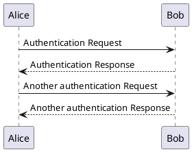
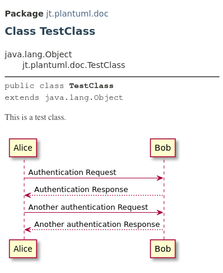

## JavaDoc PlantUML Taglet

### Introduction

The purpose of this taglet is an option to include PlantUML diagrams in the generated JavaDoc documentation. Inclusion
of diagrams in the generated documentation is done using introduced '@plantuml' tag that accepts path to the PlantUML
file. Afterwards, JavaDoc plugin with injected PlantUML taglet appends UML diagrams to output documentation in form
of SVG image files and 'img' HTML tags.

Defined goals of this library:
* **Usability** - Appending PlantUML diagrams to the generated JavaDoc documentation just by specification of links
  to corresponding PUML files.
* **Light design** - Automatic generation of diagrams based on the code leads to additional complexity which is harder
  to control, maintain, and predict. Because of these reasons, this feature is undesirable.
* **Integration with JavaDoc maven goal** - It must be possible to integrate this taglet to JavaDoc generation process
  easily without introducing of next pre-processing or post-processing steps.
* **Model-driven development**

### Properties

* Currently, only **Java 11** or newer version is supported.
* Taglet has been tested only using **'maven-javadoc-plugin'** in the Maven environment. It is not guaranteed that this
  taglet will work in other deployments with custom project structures.
* Diagrams must be stored in the PlantUML-formatted files.
* Format of JavaDoc tag: **'@plantuml [path-to-diagram]'**. The 'path-to-diagram' must be relative to source directory.
* Tag can be used within **'package-info.java'**, **'module-info.java'**, **type**, **method**, and **field**
  JavaDoc comments.
* **Multiple plantuml tags** in the single documentation block are permitted. In that case, multiple images
  per a diagram will be generated.
* **Inline tags** are not supported.
* PUML files are exported to **SVG format**. These images are included in the JavaDoc documentation using 'img'
  HTML tags.

### Example

The following tree shows sample structure of project with the class 'TestClass.java' and single sequence diagram
'sequence_diagram.puml'. All PlantUML files must be placed somewhere under 'main' directory. In this example,
the sequence diagram is placed under 'src/main/diagrams' directory.

```
plantuml-test
├── pom.xml
└── src
  └── main
    ├── diagrams
      └── sequence_diagram.puml
    └── java
      └── jt
        └── plantuml
          └── doc
            └── TestClass.java
```

The PlantUML taglet must be specified under 'maven-javadoc-plugin' together with the 'plantuml-doc' dependency:

``` xml
<plugin>
    <groupId>org.apache.maven.plugins</groupId>
    <artifactId>maven-javadoc-plugin</artifactId>
    <version>3.2.0</version>
    <configuration>
        <taglets>
            <taglet>
                <tagletClass>jt.plantuml.doc.PlantumlTaglet</tagletClass>
                <tagletArtifact>
                    <groupId>jt</groupId>
                    <artifactId>plantuml-doc</artifactId>
                    <version>1.0-SNAPSHOT</version>
                </tagletArtifact>
            </taglet>
        </taglets>
        <docfilessubdirs>true</docfilessubdirs>
        <detectJavaApiLink>false</detectJavaApiLink>
    </configuration>
</plugin>
```

Content of the 'sequence_diagram.puml' file:



'TestClass' with single JavaDoc block that contains '@plantuml' tag with specified path to the PUML file:

``` java
/**
* This is a test class.
*
* @plantuml diagrams/sequence_diagram.puml
*/
public class TestClass {
  // code
}
```

JavaDoc documentation can be generated in a standard way using Maven:

`mvn javadoc:javadoc`

Generated HTML page:



### Comparison with existing implementations

* https://github.com/plantuml/plantuml - It allows including PlantUML snippets in the JavaDoc comments - there is not
  option to add just reference to PUML file.
* https://github.com/mnlipp/jdrupes-taglets - Like previous library, there is not option to provide just a reference
  to PUML file. However, there are more types of JavaDoc tags that lead to improved flexibility in comparison
  to 'plantuml' library.
* https://github.com/gboersma/uml-java-doclet - Main goal of this library is automatic generation of UML diagrams based
  on defined rules. In the git documentation there is only a note about the capability to include custom PUML file
  in every generated diagram (see '-puml-include-file' setting).